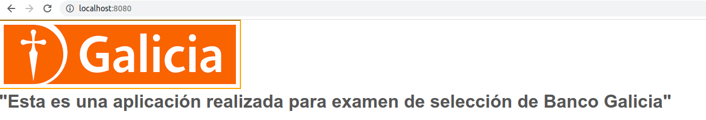

# helloworld

Demo App 

**********************************************************************
                     BUILD AND RUN ON DOCKER
**********************************************************************

docker image build -t helloworld:1.0 .

docker container run --name helloworld -p 8080:80 helloworld:1.0

$ docker image build -t helloworld:1.0 .
Sending build context to Docker daemon  65.02kB
Step 1/5 : FROM nginx:latest
latest: Pulling from library/nginx
45b42c59be33: Pull complete 
8acc495f1d91: Pull complete 
ec3bd7de90d7: Pull complete 
19e2441aeeab: Pull complete 
f5a38c5f8d4e: Pull complete 
83500d851118: Pull complete 
Digest: sha256:f3693fe50d5b1df1ecd315d54813a77afd56b0245a404055a946574deb6b34fc
Status: Downloaded newer image for nginx:latest
 ---> 35c43ace9216
Step 2/5 : COPY index.html /usr/share/nginx/html/
 ---> 5e9b47cea028
Step 3/5 : COPY logo.jpg /usr/share/nginx/html/
 ---> 267620cb5e96
Step 4/5 : COPY main.css /usr/share/nginx/html/
 ---> 9cf5699fbef8
Step 5/5 : EXPOSE 80
 ---> Running in 1519d0aa5e55
Removing intermediate container 1519d0aa5e55
 ---> 873b23ae65fa
Successfully built 873b23ae65fa
Successfully tagged helloworld:1.0

$ docker container run --name helloworld -p 8080:80 helloworld:1.0
/docker-entrypoint.sh: /docker-entrypoint.d/ is not empty, will attempt to perform configuration
/docker-entrypoint.sh: Looking for shell scripts in /docker-entrypoint.d/
/docker-entrypoint.sh: Launching /docker-entrypoint.d/10-listen-on-ipv6-by-default.sh
10-listen-on-ipv6-by-default.sh: info: Getting the checksum of /etc/nginx/conf.d/default.conf
10-listen-on-ipv6-by-default.sh: info: Enabled listen on IPv6 in /etc/nginx/conf.d/default.conf
/docker-entrypoint.sh: Launching /docker-entrypoint.d/20-envsubst-on-templates.sh
/docker-entrypoint.sh: Launching /docker-entrypoint.d/30-tune-worker-processes.sh

So now is running on localhost:8080

**********************************************************************
                     BUILD AND RUN ON S2I
**********************************************************************

$ s2i build --ref=develop https://github.com/alemiller08/helloworld centos/nginx-112-centos7 helloworld

---> Installing application source
---> Copying nginx start-hook scripts...
Build completed successfully

So now is running on localhost:8080

$ docker images
REPOSITORY                 TAG       IMAGE ID       CREATED         SIZE
helloworld                 latest    4341dbedfbcd   7 seconds ago   324MB
centos/nginx-112-centos7   latest    23b35619aecd   15 months ago   324MB
